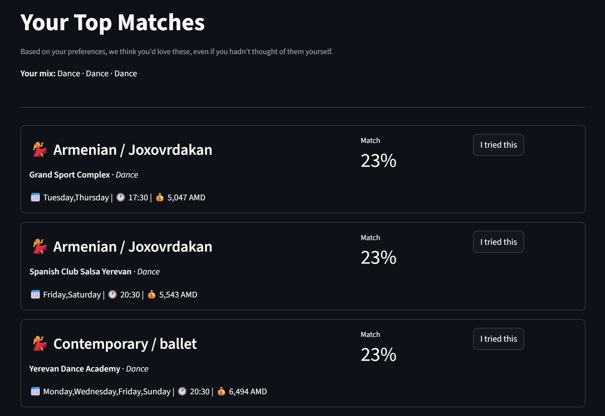
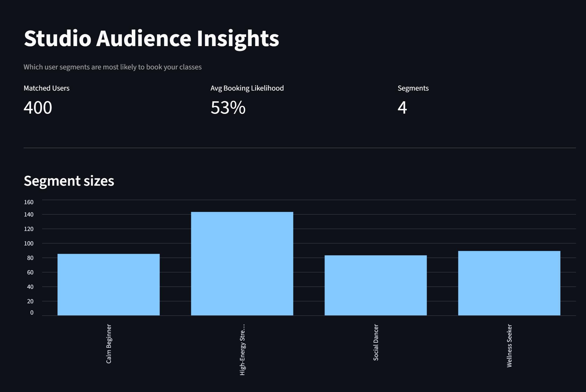
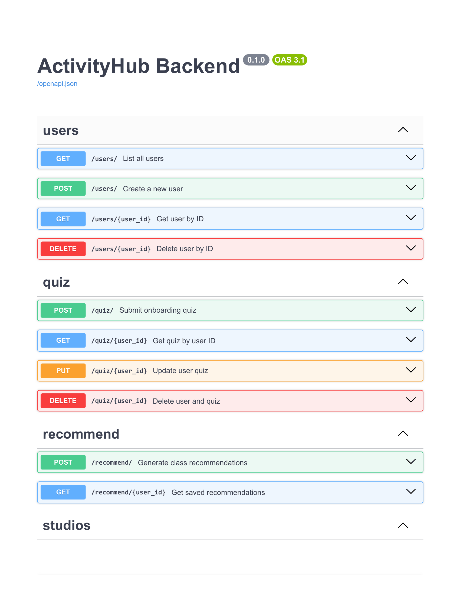
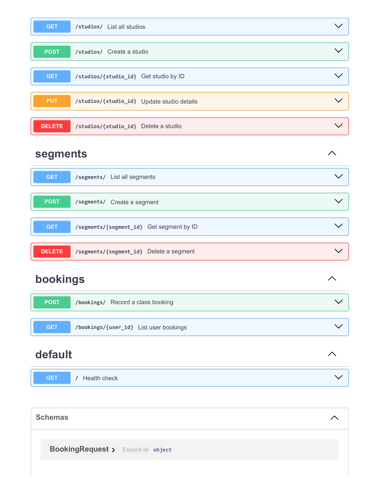

# ActivityHub

Personalized activity matching for Yerevan — yoga, dance, and fitness recommendations based on your personality, schedule, and budget.

[](https://github.com/DS-223-2026-Spring/ds223-3-project/actions)

## Links

- **Documentation:** https://ds-223-2026-spring.github.io/ds223-3-project/
- **Project board:** https://github.com/DS-223-2026-Spring/ds223-3-project/issues
- **License:** MIT — see [LICENSE](LICENSE)

## Quick start

```bash
docker compose up --build
```

Wait for `etl-1 exited with code 0`. Then open:

- **App (Streamlit):** http://localhost:8501
- **API docs (Swagger):** http://localhost:8000/docs
- **Prefect UI:** http://localhost:4200 (flow runs, logs, retries)
- **pgAdmin:** http://localhost:5050 (admin@admin.com / admin)

> If port 5050 is in use, set `PGADMIN_PORT=5051` in your `.env` and rerun.

## What's in here

| Service | Folder | Purpose |
|---------|--------|---------|
| API | `activityhub/api/` | FastAPI — quiz, recommend, segments, bookings endpoints |
| App | `activityhub/app/` | Streamlit — quiz, recommendations, studio dashboard |
| DB | `activityhub/db/` | PostgreSQL schema + CRUD utilities |
| DS | `activityhub/ds/` | Multi-class classifier + K-means segmentation |
| ETL | `activityhub/etl/` | Prefect pipeline (validate → load → train → segment) |
| Shared | `activityhub/shared/` | Inference module shared between API and DS |

## Repository Structure

```text
ds223-3-project/
│
├── .env.example                          # Template for required env vars (DB creds, pgAdmin port)
├── .gitignore
├── CONTRIBUTING.md                       # Branch model, PR process, commit conventions
├── docker-compose.yml                    # Orchestrates all 6 services (db, pgadmin, prefect, api, app, etl)
├── LICENSE                               # MIT
├── mkdocs.yml                            # Docs site config (Material theme, GitHub Pages deploy)
├── README.md                             # This file
│
├── .github/
│   └── workflows/
│       └── ci.yaml                       # Auto-builds and deploys mkdocs site on push to main
│
├── activityhub/                          # All application code
│   │
│   ├── api/                              # FastAPI backend service
│   │   ├── Dockerfile
│   │   ├── requirements.txt
│   │   └── app/
│   │       ├── main.py                   # App entry point, router registration, startup schema check
│   │       ├── database.py               # SQLAlchemy engine + session factory
│   │       ├── models/
│   │       │   └── schemas.py            # Pydantic request/response models
│   │       └── routes/
│   │           ├── bookings.py           # POST/GET — "I tried this" feedback loop
│   │           ├── quiz.py               # POST/GET/PUT/DELETE — user onboarding quiz
│   │           ├── recommend.py          # POST/GET — top-3 ML recommendations per user
│   │           ├── segments.py           # GET/POST/DELETE — K-means user personas
│   │           ├── studios.py            # GET/POST/PUT/DELETE — studio catalog CRUD
│   │           └── users.py              # GET/POST/DELETE — internal admin
│   │
│   ├── app/                              # Streamlit frontend service
│   │   ├── Dockerfile
│   │   ├── requirements.txt
│   │   ├── app.py                        # Landing page
│   │   └── pages/
│   │       ├── 1_Quiz.py                 # Onboarding quiz form
│   │       ├── 2_Recommendations.py      # Top-3 matches + booking history
│   │       └── 3_Studio_Dashboard.py     # Studio-facing audience insights
│   │
│   ├── db/                               # PostgreSQL service
│   │   ├── Dockerfile
│   │   ├── requirements.txt
│   │   ├── init.sql                      # 8-table schema (runs on volume init)
│   │   ├── connection.py                 # psycopg2 connection helper
│   │   ├── crud.py                       # Generic insert/select/update/delete with table allowlist
│   │   └── load_data.py                  # Bulk CSV loader for studios + classes
│   │
│   ├── ds/                               # Data science service
│   │   ├── Dockerfile
│   │   ├── requirements.txt
│   │   ├── data/
│   │   │   ├── studios.csv               # 23 Yerevan studios (17 real + 6 synthetic)
│   │   │   ├── classes.csv               # 159 classes (63 real + 96 synthetic)
│   │   │   ├── survey.csv                # 44 real Google Form respondents
│   │   │   ├── training_survey.csv       # Pivoted long-form training rows
│   │   │   └── training_survey_augmented.csv  # After noise augmentation
│   │   ├── models/
│   │   │   ├── style_classifier.pkl      # Trained Random Forest (winner over LR)
│   │   │   └── metrics.csv               # Top-1/Top-3 accuracy comparison
│   │   ├── notebooks/
│   │   │   └── 01_eda.ipynb              # Exploratory analysis on real survey
│   │   └── scripts/
│   │       ├── generate_synthetic_survey.py  # 270 persona-based synthetic rows
│   │       ├── prepare_survey.py         # Wide → long pivot for training
│   │       ├── augment_training.py       # Light noise augmentation (factor=2)
│   │       ├── train_model.py            # LR vs RF, picks winner by top-3 accuracy
│   │       ├── segment_users.py          # K-means clustering → 4 personas
│   │       └── run_pipeline.py           # End-to-end DS pipeline
│   │
│   ├── etl/                              # Prefect orchestration service
│   │   ├── Dockerfile
│   │   ├── requirements.txt
│   │   └── flows/
│   │       ├── pipeline.py               # Full pipeline: validate → load → train → segment
│   │       ├── dev_pipeline.py           # Fast iteration: validate + load only
│   │       ├── validate_data.py          # Schema and non-empty checks on CSVs
│   │       ├── load_data.py              # Idempotent CSV → Postgres load
│   │       ├── train_model.py            # Wraps DS training scripts as Prefect tasks
│   │       └── segment_users.py          # Wraps K-means segmentation as a Prefect task
│   │
│   └── shared/                           # Code shared between API and DS
│       └── recommend.py                  # Inference: loads pkl, scores classes, returns top-k
│
├── docs/                                 # MkDocs site (published to GitHub Pages)
│   ├── index.md                          # Problem + solution overview
│   ├── architecture.md                   # System diagram and service map
│   ├── database.md                       # Schema notes + ERD
│   ├── api.md                            # Endpoint specifications
│   ├── frontend.md                       # Page-by-page component spec
│   ├── ds.md                             # Model approach + performance metrics
│   ├── orchestration.md                  # Pipeline flows + role responsibilities
│   ├── blockers.md                       # Scope decisions and resolved blockers
│   ├── visual-analytics-guide.md         # How data flows DS → API → Frontend
│   ├── model_metrics.csv                 # Published copy of training metrics
│   └── imgs/                             # Architecture diagrams + screenshots
│
└── Milestone1/                           # M1 deliverables (initial plan, kept for reference)
    ├── Problem_Definition.pdf
    ├── Product_Roadmap.pdf
    ├── ActivityHub_UI_Prototype.pdf
    ├── MoSCoW.png
```

## Team

Group 3, DS-223 Spring 2026, AUA.

| Member | Role |
|---------|--------|
| Anna Khurshudyan | Product Manager |
| Liana Zhamkochyan | Database Developer |
| Meline Mamikonyan | Data Scientist |
| Ani Kirakosyan | Backend Dev |
| Maria Petrosyan | Frontend Dev |
| Hmayak Paravyan | Orchestration Engineer |

## Resetting state

```bash
docker compose down -v
docker compose up --build
```

That wipes the Postgres volume and reruns the full ETL pipeline.

## Screenshots

### User-facing recommendations


### Studio audience insights


### API documentation

