# Architecture

## Services
| Service | Tech | Port |
|---------|------|------|
| db | Postgres 17 | 5432 |
| pgadmin | pgAdmin 4 | 5050 |
| api | FastAPI | 8000 |
| app | Streamlit | 8501 |
| etl | Prefect | — |

## Data flow
1. ETL validates and loads `model/data/*.csv` into Postgres
2. ETL trains style classifier, saves pkl to `model/models/`
3. API loads pkl on import, serves recommendations using shared inference module
4. Frontend submits quiz, displays top-3 recommendations