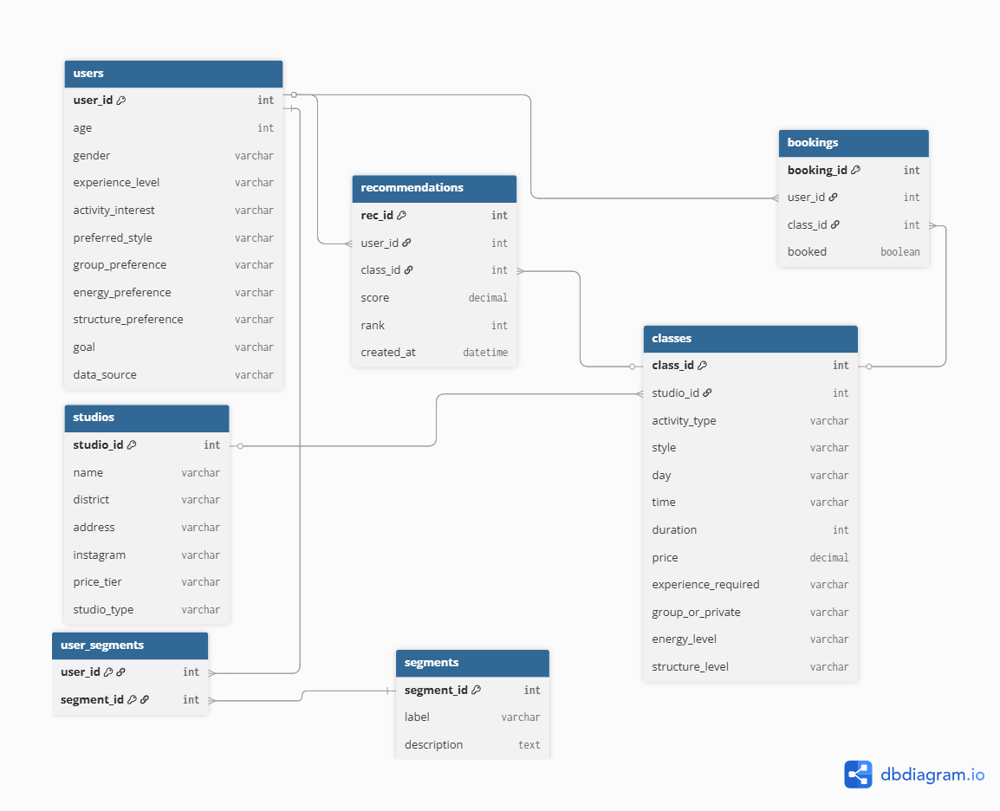

# Database

## ERD

## Schema notes
The schema implements 8 tables:

- **users** — created on quiz submission, stores demographics and data_source flag
- **quiz_responses** — preferences + practical filters, FK to users
- **studios** — 23 real Yerevan studios (yoga, dance, fitness)
- **classes** — 159 classes, each FK to a studio
- **segments** — user personas from K-means clustering
- **user_segments** — many-to-many join table for cluster assignments
- **recommendations** — log of model outputs per user with score + rank
- **bookings** — "I tried this" feedback records, feeds future retraining

## ERD Validation

The schema in `db/init.sql` was reviewed and approved by:

- **Liana Zhamkochyan (DB Developer)** — implemented all 7 tables, foreign keys, cascades, indexes
- **Meline Mamikonyan (Data Scientist)** — confirmed users/quiz_responses/classes columns match model feature requirements
- **Anna Khurshudyan (PM)** — verified schema supports product flows (quiz submission, recommendation generation, segment storage)

See `db/init.sql` for the full schema.

